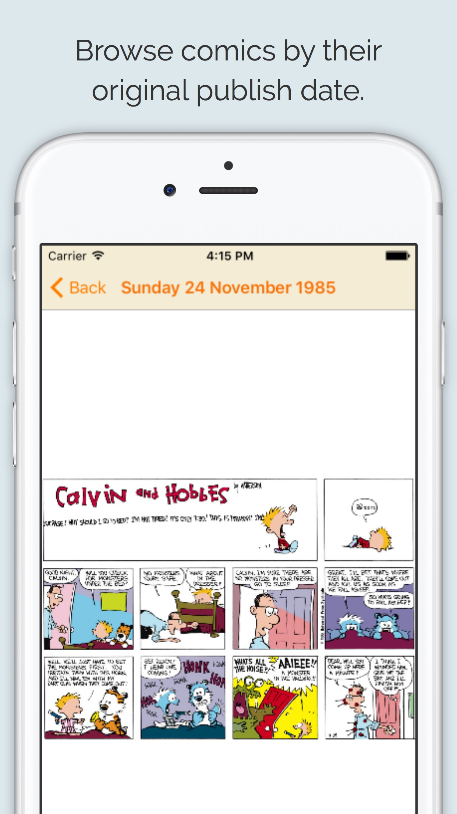
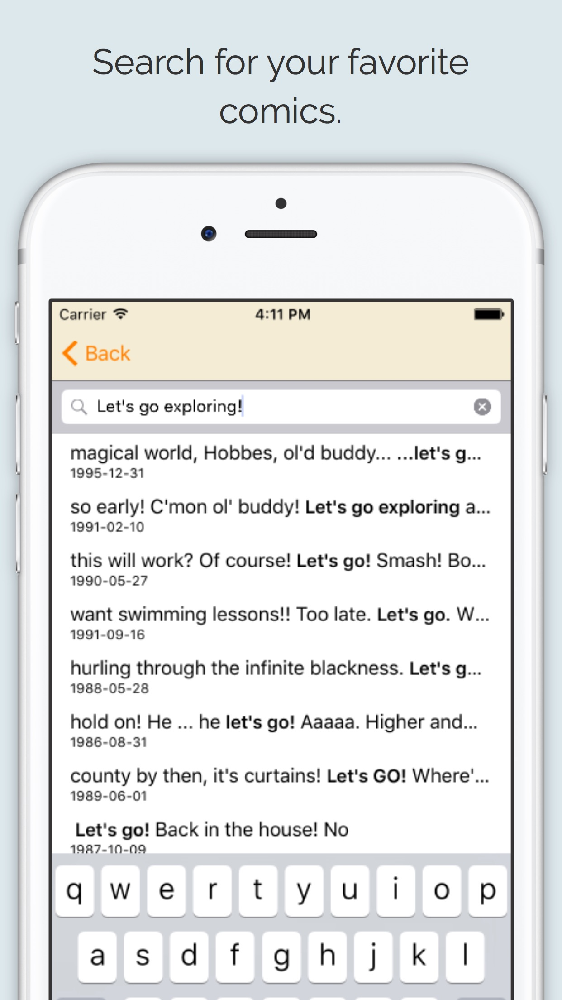

# Comic View for Calvin and Hobbes

> an iOS app for reading Calvin and Hobbes comics

</img> </img>

# Installation

If you want to install this app before approval by the App Store and have a Mac, you can build and install the app onto your device.

First, make sure you have a developer account with Apple. This is necessary to install the app on your device. You need to [set up a provisioning profile](https://developer.apple.com/library/ios/qa/qa1814/_index.html) for you copy of Xcode. 

Then, simply download the zip folder of this repository and open the Xcode project in `/Server`. Connect your iPhone to your computer and select it as the build target in the top left corner of Xcode. If your phone doesn't show up, you may need to add it to the organizer (follow [these directions](https://support.smartbear.com/viewarticle/73275/)). Finally, click the run button or press `⌘ + R` to upload the app to your phone.

# Contributing

If you have a feature you would like to add or a bug you have found, either implement the fix or open an issue! Don't hesitate to email me at adam.vanpr@gmail.com if you have any questions.

>test
>
>sdfadfa